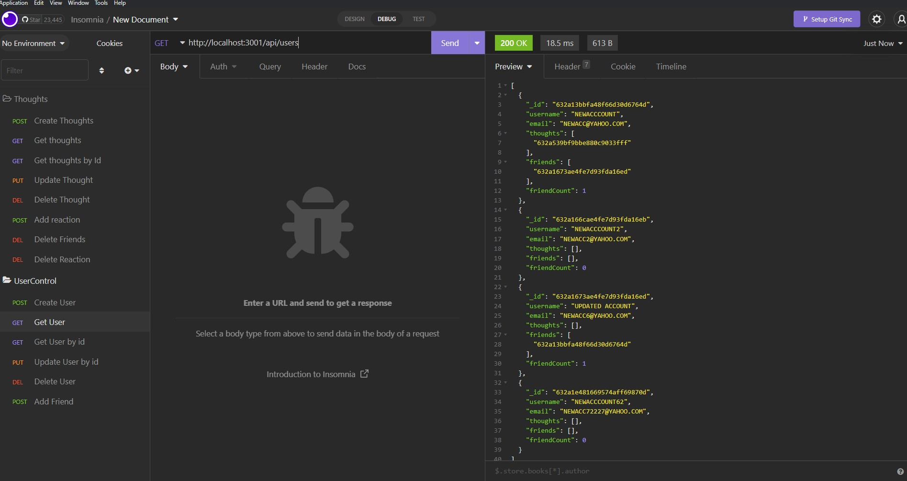
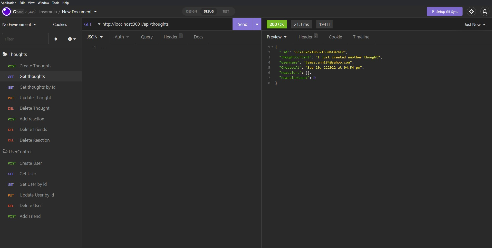
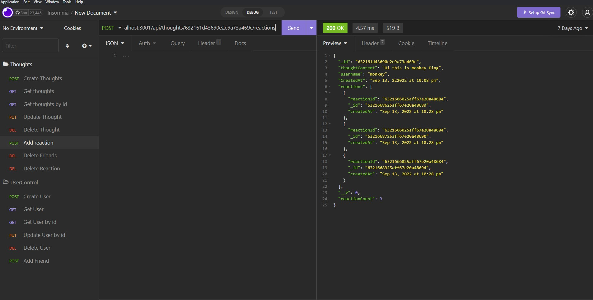

# SocialMedia-API system

## Description
Set up a backend system for social media API using NodeJS/Express/MongoDB.

## Motivation
The purpose of this repository is to build a CRUD system for a social media application. Before any other operations, all of the routes system must be accurately and functionally operate. 

## Usage
1. Set up MongoDB connection, seek  [MongoDB Website](https://docs.mongodb.com/manual/installation/) to learn more about how to set up the MongoDB connection.
3. Install dependencies.
5. Use  [Insomnia](https://insomnia.rest/) to test the REST API endpoints.
## Mock Up

## Enpoints for testing
**User**

**Thought**

**Reaction**

## Technologies
Technologies used for this project are: 
- NodeJS
- Express
- Mongoose
- Moment
- Nodemon

